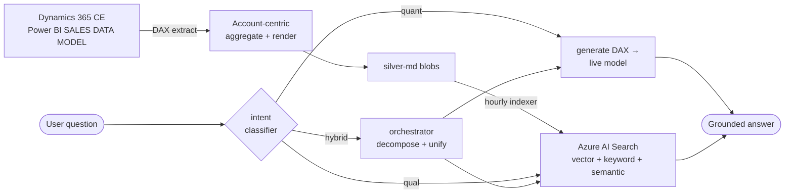

# CRM Hybrid Adaptive Agentic RAG

[](https://github.com/rungrojcsi/CRM-Hybrid-Adaptive-Agentic-RAG/actions/workflows/ci.yml)

Ask the CRM in plain language and get grounded answers — a hybrid, adaptive, lightly-agentic RAG pipeline over the Dynamics 365 / Power BI "SALES DATA MODEL". Numeric questions are answered with generated DAX against the live model; qualitative questions with vector retrieval over account-centric markdown; mixed questions with both, unified.

> **Status: legacy / paused.** The active work moved to win-probability ML — see
> [CRM-Win-Probability-Deal-Prediction-ML](https://github.com/rungrojcsi/CRM-Win-Probability-Deal-Prediction-ML). This is the RAG pipeline,
> split out of the `RAG_Azure` monorepo (2026-08) to keep its own lifecycle.
>
> **Internal use only — CSI GROUPS.** Real client names are never committed — docs and fixtures use synthetic names.

## Business End-Users

**Primary users — Sales & Marketing**, self-serving answers about accounts, deals, and pipeline in plain language (Thai).

**The shift:** questions that used to route through the **Business Analysis team — slow and often inaccurate** — are now answered directly by the system in seconds, grounded in the certified model. Analysts move off ad-hoc lookups; the frontline gets answers on demand.

## 1. Pain Points

Problems getting value out of CRM data before this tool existed:

- **The data was locked in Dynamics 365 / Power BI** — a salesperson who wanted "how many open deals does account X have and why are they stuck" had to ask an analyst; there was no natural-language front door.
- **Numeric questions needed someone who could write DAX** — totals, top-N, win rates, time-period aggregations all required a human to author a query against the semantic model.
- **Qualitative context was buried** — account history, meeting notes, and the "why" behind a deal lived in free text no one could search across 11,500 accounts.
- **One retrieval method could never cover both** — plain vector RAG hallucinates numbers; plain text-to-DAX can't tell a customer story.

## 2. Gap

| What the CRM already had | What was missing |
|--------------------------|------------------|
| A certified Power BI semantic model (31 tables) | No natural-language way to query it |
| ~9,300 accounts of narrative history | No cross-account semantic search |
| Accurate numbers via DAX measures | No automatic DAX generation from a question |
| Both numeric and narrative needs | No single system that routes each question to the right method and combines answers |

## 3. Concept

Classify what the question needs, retrieve with the right method, and combine — the three adjectives in the name each map to code:

1. **Adaptive** — an intent classifier tags each question `quant | qual | hybrid` and routes it (`transform/intent_classifier.py`)
2. **Hybrid** — retrieval combines vector + keyword + semantic reranking in one Azure AI Search query, and combines the quant path (DAX over the live model) with the qual path (vector over markdown)
3. **Agentic** — an orchestrator decomposes a multi-part question into sub-questions, DAX is generated and run as a tool, the quant path self-corrects on failure, and the parts are unified into one grounded answer (Thai)

## 4. Where It Sits

Upstream of the retrieval sits a one-way data flow from the live CRM model into searchable form:



## 5. Design

Design principles:

- **Right retriever per question** — the intent classifier prevents the two classic failures (vector RAG inventing numbers; text-to-DAX unable to narrate)
- **Numbers come from the certified model, not the LLM** — the quant path generates DAX and executes it against the live Power BI model, so aggregates match the CRM's certified measures
- **Account-centric documents** — the transform layer renders one markdown doc per account (plus solution / salesperson / industry lenses) so retrieval returns coherent context, not scattered rows
- **Self-correcting quant path** — `quant_pipeline.run_with_retry` retries failed DAX with feedback before giving up
- **Test-first with synthetic fixtures** — the full suite runs with no live data and no Azure credentials

### In-app pipeline

| Stage | Files | Role |
|-------|-------|------|
| Ingest / transform | `transform/{dax_extractor,cdm_parser,aggregator,renderer,lenses}.py` + `templates/` | live model → account-centric markdown in `silver-md` |
| Index | Azure AI Search integrated vectorization (hourly) | vector + keyword + semantic index |
| Classify + route | `transform/intent_classifier.py` | `quant \| qual \| hybrid` |
| Qual retrieval | `transform/{ai_searcher,searcher,asker}.py` | hybrid search → GPT answer |
| Quant retrieval | `transform/{dax_generator,pbi_client,quant_pipeline,quant_provenance}.py` | generate + run DAX, with provenance |
| Orchestrate | `transform/{orchestrator,synthesizer}.py` | decompose sub-questions, unify answers |

## 6. Implementation (status)

| Item | Status |
|------|--------|
| Transform: live model → account-centric markdown (+ lenses) | ✅ Working |
| Azure AI Search hybrid retrieval (vector + keyword + semantic) | ✅ Working (~10,940 docs indexed) |
| Intent classifier + adaptive routing | ✅ Working |
| Quant path: DAX generation + live execution + self-retry | ✅ Working |
| Agentic orchestrator: sub-question decompose + unify | ✅ Working |
| Foundry agent (`crm-rag-agent`, Thai) over the API | ✅ Configured |
| Unit tests (synthetic fixtures) + CI | ✅ Green |
| **Auth on `ask*` routes** | ⛔ `ANONYMOUS` — see security debt below |
| pgvector backend (Neon) | ⏳ superseded by AI Search; `/api/ask-pg` kept for comparison |

## Developer guide

### ⚠️ Security debt (fix before any real use)

The `ask` / `ask-pg` / `ask-combined` / `ask-quant` / `orchestrator` / `ask-hybrid` routes are
`AuthLevel.ANONYMOUS` — anyone who knows the URL can query CRM-grounded answers and burn the
OpenAI budget. Behavior was preserved as-is during the repo split. Change these to
`AuthLevel.FUNCTION` (or front the Function App with Easy Auth) before exposing it.

### API (Azure Functions — `function-app`)

```
POST /api/transform      rebuild silver-md from the live model (also hourly timer)
POST /api/search         vector search (raw chunks)
POST /api/ask            full RAG: retrieve → GPT answer          [ANONYMOUS — see debt]
POST /api/ask-pg         RAG via pgvector backend                 [ANONYMOUS]
POST /api/ask-combined   merge AI Search + pgvector               [ANONYMOUS]
POST /api/ask-quant      DAX-generated numeric answer             [ANONYMOUS]
POST /api/orchestrator   multi-subquestion plan + unify           [ANONYMOUS]
POST /api/ask-hybrid     intent-routed quant/qual                 [ANONYMOUS]
```

### Structure

```
function-app/
  function_app.py     Azure Functions entry — RAG routes only
  transform/          the pipeline (see the Design table above)
  templates/          Jinja2 account/solution/salesperson/industry markdown templates
  openapi_*.json      OpenAPI specs for the Foundry agent tools
  tests/              unit tests — synthetic fixtures, no live data
dax/                  certified measure references + schema
fabric/               Fabric notebook (bronze ingest)
webui/                minimal query UI
docs/RAG/             project summary + test transcripts
```

### Dev

```bash
python -m venv .venv && source .venv/bin/activate
cd function-app
pip install -r requirements.txt
pytest tests/ -q
```

> One pre-existing test (`test_dax_extractor.py::test_rows_to_df_strips_casts_and_fills_missing`)
> fails under pandas 3.x — the code pins pandas 2.2.3; carried over from the monorepo as-is. CI
> installs the pinned versions, where it passes.

### Deploy

```bash
func azure functionapp publish function-app --build remote
```

Hosting: RG `RESOURCE_GROUP`, `southeastasia`. Retrieval backend: Azure AI Search `<resource>`; Foundry agent `crm-rag-agent`.
